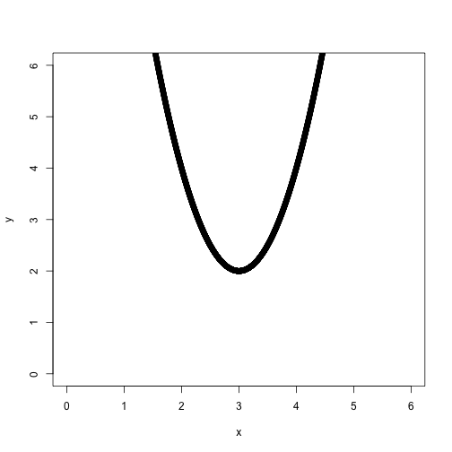
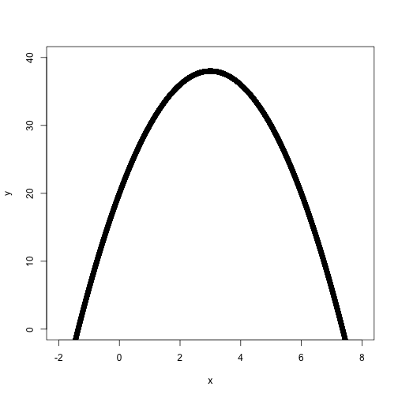

Maximum Likelihood Estimation
========================================================
author: William Reed
date: September 6, 2018
autosize: true

Overview
========================================================
incremental: true

What is the goal of politcal analysis?

Use data to obtain an estimate of the population parameter that has “nice” propoerties (unbiased and low variance).

- We call this estimate a sample statistic.
- GVPT622: $~\bar{x}\rightarrow\mu, \hat{p}\rightarrow p$
- GVPT722: $~\hat{\beta}\rightarrow\beta$
- GVPT729A: Finding a sample statistics with nice properties when there is not always an analytical solution to the estimation problem.

Examples
========================================================
incremental: true
- Find $~\bar{x}~$ using common sense.
- Find $~\hat{\beta}_0,\hat{\beta}_{1}$ using the method of moments.
- Find $~\hat{\beta}_0,\hat{\beta}_{1}$ by minimizing sum of squared errors.

OLS
========================================================
incremental: true

- Zero Conditional Mean Assumption $E(u|x)=0$
- Implications: $E(u)=0$
- How do we find $\hat{\beta}$'s?
- Minimize SSR?
- $20-12x+2x^2$
- $20+12x-2x^2$

Max/Min
========================================================

```r
x<-seq(0,6,by=.001)
y<-20-12*x+2*x^2
plot(x,y,xlim=range(0,6),ylim=range(0,6))
```



Max/Min
========================================================

```r
x<-seq(-2,8,by=.001)
y<-20+12*x-2*x^2
plot(x,y,xlim=range(-2,8),ylim=range(0,40))
```


